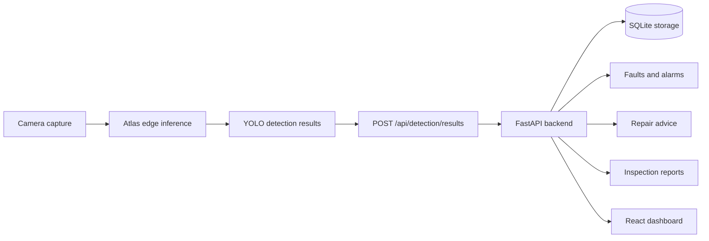

<div align="center">

# EdgeEye

Inspection demo system for an Atlas/YOLO edge pipeline, FastAPI backend, and React dashboard frontend.

[](backend/)
[](web/)
[](backend/pyproject.toml)
[](web/tsconfig.app.json)
[](docs/openapi.yaml)

English | [简体中文](README.zh-CN.md)

</div>

## Overview

EdgeEye connects edge-side inspection data with backend persistence, alarms, repair advice, report generation, and a dashboard UI. The project is organized around a minimum demonstrable inspection flow: camera capture, Atlas edge inference, YOLO detection results, backend API storage and aggregation, and frontend visualization.

The current repository focuses on the runnable backend service, the React dashboard, and the integration contracts used by all team members.

| Area | Stack | Purpose |
| --- | --- | --- |
| `backend/` | Python + FastAPI + SQLite | API service, inspection storage, detection upload, alarms, advice fallback, dashboard data, and report export |
| `training/` | Python 3.12 + uv + Ultralytics | Local YOLO dataset preparation, training entry point, and ONNX export scripts |
| `dataset/` | YOLO workspace + source notes | Ignored raw/processed data plus committed lightweight source and cleanup docs |
| `web/` | TypeScript + React + Vite | Operational dashboard for system status, realtime inspection, fault center, reports, and assets |
| `docs/` | Markdown + OpenAPI | Cross-member contracts, API behavior, integration notes, responsibilities, and review records |
| `docker-compose.yml` | Docker Compose | Member 4 backend deployment scaffold with persistent volumes |

## Contents

- [Architecture](#architecture)
- [What Is Included](#what-is-included)
- [Quick Start](#quick-start)
- [Backend](#backend)
- [Training](#training)
- [Frontend](#frontend)
- [Configuration](#configuration)
- [API Surface](#api-surface)
- [Contracts](#contracts)
- [Development Checks](#development-checks)
- [Repository Layout](#repository-layout)

## Architecture



The edge side submits key-frame detection payloads to the backend. The backend keeps idempotent detection results, aggregates faults and alarms, exposes system and dashboard data, generates rule-template advice when no LLM provider is configured, and serves report export files. The frontend consumes backend-shaped API data and uses typed fallback states when the API is unavailable.

## What Is Included

| Capability | Current support |
| --- | --- |
| Health and system status | `GET /api/health`, `GET /api/system/status` |
| Dashboard summary | Counts, active inspections, unresolved faults and alarms, latest high-risk alarm |
| Inspection lifecycle | Start, finish, fail, list, and latest-result queries |
| Detection upload | JSON payload upload with bbox validation, idempotency, and duplicate-frame protection |
| Fault center | Devices, faults, alarms, aggregated events, and process-status updates |
| Repair advice | Rule-template fallback by default; optional OpenAI-compatible provider configuration |
| Reports | Report list/detail and HTML/PDF export entry points |
| Frontend dashboard | Dashboard, realtime inspection, fault center, report center, assets, and demo login shell |

## Quick Start

Run the backend in one terminal:

```bash
cd backend
uv sync
uv run uvicorn app.main:app --reload
```

Run the frontend in another terminal:

```bash
cd web
bun install
bun run dev
```

Default local URLs:

| Service | URL |
| --- | --- |
| Backend API | `http://localhost:8000/api` |
| Frontend | `http://localhost:5173` |

## Backend

The backend is a FastAPI service for member 4 responsibilities: API endpoints, SQLite persistence, dashboard data, system status, alarms, reports, and backend repair-advice generation.

Start the backend from `backend/`:

```bash
uv sync
uv run uvicorn app.main:app --reload
```

Run backend tests:

```bash
uv run pytest
```

Run the backend with Docker Compose from the repository root:

```bash
docker compose up --build backend
```

The Compose setup exposes `8000:8000` and persists database files, uploaded images, and exported reports in named volumes.

## Frontend

The frontend is a React + Vite dashboard for member 5 work: dashboard overview, realtime inspection, fault center, report center, assets, and later end-to-end demo flows.

Start the frontend from `web/`:

```bash
bun install
bun run dev
```

Build the frontend:

```bash
bun run build
```

The frontend calls `/api` by default and falls back to typed mock data when the backend is unavailable. Set `VITE_API_BASE_URL` when the API runs on a different base URL:

```bash
VITE_API_BASE_URL=http://localhost:8000/api bun run dev
```

## Training

The training workspace prepares the first detector dataset with four YOLO
classes: `insulator_normal`, `insulator_surface_damage`, `transformer_normal`,
and `transformer_surface_damage`. Large raw archives and generated processed
datasets stay ignored by git; commit only scripts, config, and lightweight docs.

The optimized insulator-focused candidates are tracked separately under
`edgeeye-insulator-v1*`. They use two classes, export ONNX as
`output0 [1,6,8400]`, and are not direct replacements for the four-class
`edgeeye-detector-v1` baseline without an explicit promotion decision. The
current recall-first candidate is
`edgeeye-insulator-v1-domain-r1-opt30-yolov8s-adamw`.

Prepare and validate the local dataset from `training/`:

```bash
uv sync
uv run python prepare_dataset.py --overwrite
uv run python validate_dataset.py \
  --dataset ../dataset/processed/edgeeye-detector-v1/dataset.yaml \
  --classes ../dataset/processed/edgeeye-detector-v1/classes.json \
  --labels ../dataset/processed/edgeeye-detector-v1/label.names
```

See [training/README.md](training/README.md), [dataset/README.md](dataset/README.md),
[dataset/docs/edgeeye-detector-v1-report.md](dataset/docs/edgeeye-detector-v1-report.md),
[dataset/docs/edgeeye-insulator-v1-optimization-report.md](dataset/docs/edgeeye-insulator-v1-optimization-report.md),
and
[dataset/docs/edgeeye-insulator-v1-domain-r1-report.md](dataset/docs/edgeeye-insulator-v1-domain-r1-report.md)
for source mappings, class distribution, optimization metrics, and remaining
training risks.

## Configuration

Backend environment variables use the `EDGEEYE_` prefix. See [backend/.env.example](backend/.env.example) for a copyable template.

| Variable | Purpose | Default |
| --- | --- | --- |
| `EDGEEYE_DATABASE_PATH` | SQLite database path | `data/edgeeye.db` |
| `EDGEEYE_UPLOADS_DIR` | Static root served at `/uploads` | `uploads` |
| `EDGEEYE_REPORTS_DIR` | Static root served at `/reports` | `reports` |
| `EDGEEYE_LLM_PROVIDER` | Provider selector | `rule-template` |
| `EDGEEYE_LLM_API_URL` | Optional OpenAI-compatible chat-completions endpoint | unset |
| `EDGEEYE_LLM_API_KEY` | Backend-only LLM API key | unset |
| `EDGEEYE_LLM_MODEL_NAME` | Model name metadata for advice output | `rule-template` |
| `EDGEEYE_ALARM_DEDUP_WINDOW_SECONDS` | Alarm deduplication window | `300` |

When no provider is configured or the provider call fails, `POST /api/advice/generate` saves and returns a complete rule-template fallback advice object.

## API Surface

<details>
<summary>Implemented backend endpoints</summary>

| Domain | Method | Path |
| --- | --- | --- |
| Health | `GET` | `/api/health` |
| System | `GET` | `/api/system/status` |
| Dashboard | `GET` | `/api/dashboard` |
| Inspections | `POST` | `/api/inspection/start` |
| Inspections | `POST` | `/api/inspections/{id}/finish` |
| Inspections | `POST` | `/api/inspections/{id}/fail` |
| Inspections | `GET` | `/api/inspections` |
| Inspections | `GET` | `/api/inspections/{id}/latest-result` |
| Detection | `POST` | `/api/detection/results` |
| Assets | `GET` | `/api/devices` |
| Fault center | `GET` | `/api/faults` |
| Fault center | `GET` | `/api/alarms` |
| Fault center | `GET` | `/api/events` |
| Fault center | `PATCH` | `/api/faults/{id}/status` |
| Fault center | `PATCH` | `/api/alarms/{id}/status` |
| Advice | `POST` | `/api/advice/generate` |
| Advice | `GET` | `/api/faults/{id}/advice` |
| Reports | `GET` | `/api/reports` |
| Reports | `GET` | `/api/reports/{id}` |
| Reports | `GET` | `/api/reports/{id}/export` |

</details>

## Contracts

The source of truth for cross-module fields and API behavior is:

| Document | Purpose |
| --- | --- |
| [docs/contracts.md](docs/contracts.md) | Shared data shapes, enums, API response envelope, idempotency, and frontend data contracts |
| [docs/openapi.yaml](docs/openapi.yaml) | Machine-checkable API contract |
| [docs/api-spec.md](docs/api-spec.md) | Endpoint-level API specification |
| [docs/interfaces-and-deliverables.md](docs/interfaces-and-deliverables.md) | Cross-member data flow, responsibilities, and handoff boundaries |
| [docs/engineering-standards.md](docs/engineering-standards.md) | Repository, configuration, logging, testing, and integration standards |

Any temporary field, enum, or route change must update the relevant contract documents before the implementation depends on it.

## Development Checks

Use these checks before handing off integration work:

```bash
cd backend
uv run pytest
```

```bash
cd web
bun run build
```

```bash
cd training
uv run python validate_dataset.py \
  --dataset ../dataset/processed/edgeeye-detector-v1/dataset.yaml \
  --classes ../dataset/processed/edgeeye-detector-v1/classes.json \
  --labels ../dataset/processed/edgeeye-detector-v1/label.names
```

For documentation and API contract changes, also verify that [docs/openapi.yaml](docs/openapi.yaml) still parses and matches the implementation surface.

## Repository Layout

```text
.
├── backend/              FastAPI service, API routes, Pydantic models, SQLite services, tests
├── dataset/              Local dataset workspace, source notes, and cleanup reports
├── docs/                 Contracts, engineering standards, module documents, OpenAPI spec
├── training/             YOLO dataset preparation, training, and ONNX export scripts
├── web/                  React + Vite dashboard frontend
├── docker-compose.yml    Backend deployment scaffold
└── README.md             Project entry point
```
