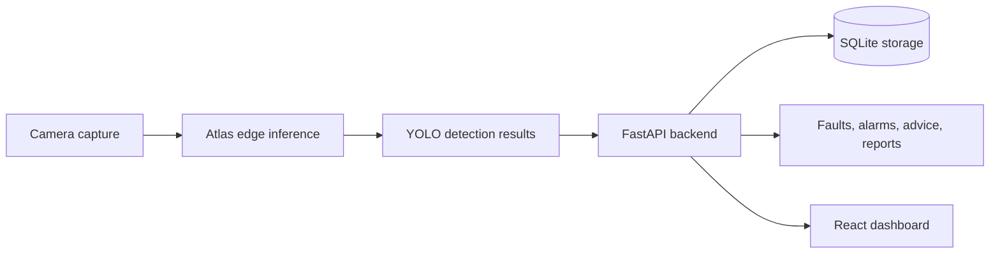

<div align="center">

# EdgeEye

Inspection demo system for an Atlas/YOLO edge pipeline, FastAPI backend, and React dashboard frontend.

[](backend/)
[](web/)
[](backend/pyproject.toml)
[](web/tsconfig.json)
[](docs/openapi.yaml)

</div>

## Overview

EdgeEye connects edge-side inspection data with backend persistence, alarms, advice generation, reports, and a dashboard UI. The current repository contains:

| Area | Stack | Purpose |
| --- | --- | --- |
| `backend/` | Python + FastAPI | API service, storage, inspection data, alarms, advice, and reports |
| `web/` | TypeScript + React + Vite | Dashboard frontend for system, realtime, fault, report, and asset views |
| `docs/` | Markdown + OpenAPI | Contracts, member responsibilities, API behavior, and integration notes |

## Contents

- [Architecture](#architecture)
- [Quick Start](#quick-start)
- [Applications](#applications)
- [Backend API](#backend-api)
- [Frontend](#frontend)
- [Contracts](#contracts)

## Architecture



## Quick Start

Run the backend:

```bash
cd backend
uv sync
uv run uvicorn app.main:app --reload
```

Run the frontend:

```bash
cd web
bun install
bun run dev
```

Default local URLs:

| Service | URL |
| --- | --- |
| Backend API | `http://localhost:8000/api` |
| Frontend | `http://localhost:5173` |

## Applications

```text
backend/  Python + FastAPI API service
web/      TypeScript + React + Vite frontend
docs/     contracts, member responsibilities, and integration notes
```

## Backend API

Start the backend from `backend/`:

```bash
uv sync
uv run uvicorn app.main:app --reload
```

Run backend tests:

```bash
uv run pytest
```

<details>
<summary>Implemented backend endpoints</summary>

| Method | Path |
| --- | --- |
| `GET` | `/api/health` |
| `GET` | `/api/system/status` |
| `GET` | `/api/dashboard` |
| `POST` | `/api/inspection/start` |
| `POST` | `/api/inspections/{id}/finish` |
| `POST` | `/api/inspections/{id}/fail` |
| `GET` | `/api/inspections` |
| `GET` | `/api/inspections/{id}/latest-result` |
| `POST` | `/api/detection/results` |
| `GET` | `/api/devices` |
| `GET` | `/api/faults` |
| `GET` | `/api/alarms` |
| `GET` | `/api/events` |
| `PATCH` | `/api/faults/{id}/status` |
| `PATCH` | `/api/alarms/{id}/status` |
| `POST` | `/api/advice/generate` |
| `GET` | `/api/faults/{id}/advice` |
| `GET` | `/api/reports` |
| `GET` | `/api/reports/{id}` |
| `GET` | `/api/reports/{id}/export` |

</details>

## Frontend

Start the frontend from `web/`:

```bash
bun install
bun run dev
```

Build the frontend:

```bash
bun run build
```

The frontend calls `/api` by default and falls back to typed mock data when the backend is unavailable. Set `VITE_API_BASE_URL` if the API runs on a different base URL.

## Contracts

The source of truth for cross-module fields and API behavior is:

- [docs/contracts.md](docs/contracts.md)
- [docs/openapi.yaml](docs/openapi.yaml)
- [docs/api-spec.md](docs/api-spec.md)
