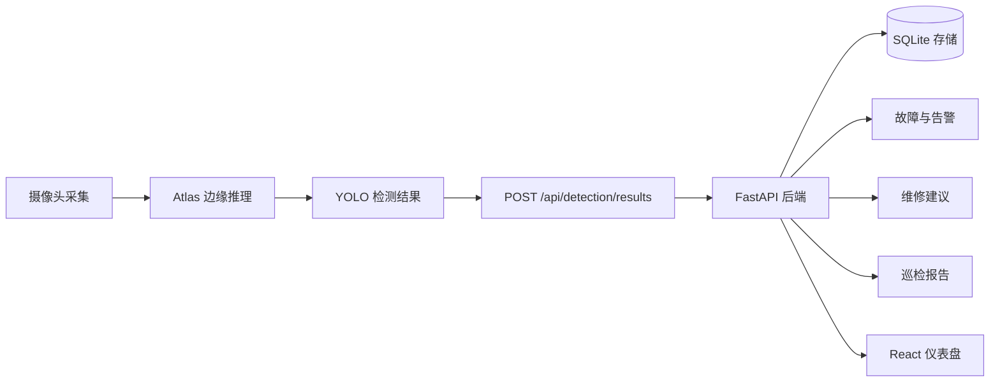

<div align="center">

# EdgeEye

面向电力设备智能巡检演示链路的项目入口，覆盖 Atlas/YOLO 边缘推理、FastAPI 后端和 React 可视化前端。

[](backend/)
[](web/)
[](backend/pyproject.toml)
[](web/tsconfig.app.json)
[](docs/openapi.yaml)

[English](README.en.md) | 简体中文

</div>

## 项目概览

EdgeEye 用于打通边缘侧巡检数据、后端持久化、告警生成、维修建议、报告导出和前端展示。项目围绕一个最小可演示巡检链路组织：摄像头采集、Atlas 边缘推理、YOLO 检测结果、后端 API 存储与聚合、前端可视化展示。

当前仓库重点包含可运行的后端服务、React 仪表盘，以及全组联调使用的数据契约。

| 区域 | 技术栈 | 作用 |
| --- | --- | --- |
| `backend/` | Python + FastAPI + SQLite | API 服务、巡检存储、检测结果上传、告警、维修建议降级生成、Dashboard 数据和报告导出 |
| `training/` | Python 3.12 + uv + Ultralytics | 本地 YOLO 数据集准备、训练入口和 ONNX 导出脚本 |
| `dataset/` | YOLO 工作区 + 数据源说明 | 被忽略的原始/处理后数据，以及轻量数据源和清洗报告文档 |
| `web/` | TypeScript + React + Vite | 系统状态、实时巡检、故障中心、报告中心和资源视图 |
| `docs/` | Markdown + OpenAPI | 跨成员数据契约、API 行为、联调说明、职责边界和审查记录 |
| `docker-compose.yml` | Docker Compose | 成员 4 后端部署脚手架和持久化卷配置 |

## 目录

- [系统架构](#系统架构)
- [当前能力](#当前能力)
- [快速启动](#快速启动)
- [后端](#后端)
- [训练](#训练)
- [前端](#前端)
- [配置](#配置)
- [API 概览](#api-概览)
- [契约文档](#契约文档)
- [工作入口](#工作入口)
- [开发检查](#开发检查)
- [本地生成物](#本地生成物)
- [仓库结构](#仓库结构)

## 系统架构



边缘侧向后端提交关键帧检测结果。后端负责保存幂等检测结果、聚合故障和告警、提供系统状态与 Dashboard 数据、在未配置大模型服务时使用规则模板生成维修建议，并提供报告导出文件。前端消费后端定义好的 API 数据；当后端不可用时，前端会使用类型化的降级状态。

## 当前能力

| 能力 | 当前支持 |
| --- | --- |
| 健康检查与系统状态 | `GET /api/health`、`GET /api/system/status` |
| Dashboard 总览 | 设备数、巡检数、故障数、告警数、运行中巡检、未处理故障/告警、最新高风险告警 |
| 巡检生命周期 | 创建、完成、失败、列表查询和最新结果查询 |
| 检测结果上传 | JSON 上传、检测框越界校验、幂等键、重复帧保护 |
| 故障中心 | 设备、故障、告警、聚合事件和处理状态更新 |
| 维修建议 | 默认规则模板降级生成；可配置 OpenAI 兼容接口 |
| 报告中心 | 报告列表、报告详情和 HTML/PDF 导出入口 |
| 前端仪表盘 | Dashboard、实时巡检、故障中心、报告中心、资源视图和演示登录壳 |

## 快速启动

在一个终端启动后端：

```bash
cd backend
uv sync
uv run uvicorn app.main:app --reload
```

在另一个终端启动前端：

```bash
cd web
bun install
bun run dev
```

默认本地地址：

| 服务 | 地址 |
| --- | --- |
| 后端 API | `http://localhost:8000/api` |
| 前端页面 | `http://localhost:5173` |

## 后端

后端是成员 4 负责的 FastAPI 服务，覆盖 API 端点、SQLite 持久化、Dashboard 数据、系统状态、告警、报告和维修建议生成。

在 `backend/` 目录启动：

```bash
uv sync
uv run uvicorn app.main:app --reload
```

运行后端测试：

```bash
uv run pytest
```

也可以在仓库根目录使用 Docker Compose 启动后端：

```bash
docker compose up --build backend
```

Compose 配置会暴露 `8000:8000`，并通过命名卷持久化数据库、上传图片和导出报告。

## 前端

前端是成员 5 负责的 React + Vite 仪表盘，覆盖 Dashboard 总览、实时巡检、故障中心、报告中心、资源视图，以及后续端到端演示流程。

在 `web/` 目录启动：

```bash
bun install
bun run dev
```

构建前端：

```bash
bun run build
```

前端默认请求 `/api`，当后端不可用时会使用类型化 mock/降级数据。后端不在默认地址时，可以设置 `VITE_API_BASE_URL`：

```bash
VITE_API_BASE_URL=http://localhost:8000/api bun run dev
```

实时页面每秒刷新现有 latest-result API 路径；后端相机桥启用时，不需要再启动单独的摄像头进程。

## 训练

训练工作区用于准备第一版检测模型数据集，包含四个 YOLO 类别：
`insulator_normal`、`insulator_surface_damage`、`transformer_normal` 和
`transformer_surface_damage`。大型原始归档和生成后的 processed 数据不进
git，只提交脚本、配置和轻量文档。

当前优化候选模型单独记录为 `edgeeye-insulator-v1`，只包含两个绝缘子类别，
ONNX 输出为 `output0 [1,6,8400]`。它不是四类 `edgeeye-detector-v1`
基线的直接替换；是否晋升为交付模型需要单独确认。当前召回优先候选模型是
`edgeeye-insulator-v1-domain-r1-opt30-yolov8s-adamw`。

在 `training/` 目录准备并校验本地数据集：

```bash
uv sync
uv run python prepare_dataset.py --overwrite
uv run python validate_dataset.py \
  --dataset ../dataset/processed/edgeeye-detector-v1/dataset.yaml \
  --classes ../dataset/processed/edgeeye-detector-v1/classes.json \
  --labels ../dataset/processed/edgeeye-detector-v1/label.names
```

数据源映射、类别分布和剩余训练风险见
[training/README.md](training/README.md)、[dataset/README.md](dataset/README.md)
、[dataset/docs/edgeeye-detector-v1-report.md](dataset/docs/edgeeye-detector-v1-report.md)
和
[dataset/docs/edgeeye-insulator-v1-optimization-report.md](dataset/docs/edgeeye-insulator-v1-optimization-report.md)
以及
[dataset/docs/edgeeye-insulator-v1-domain-r1-report.md](dataset/docs/edgeeye-insulator-v1-domain-r1-report.md)。

## 配置

后端环境变量统一使用 `EDGEEYE_` 前缀。可参考 [backend/.env.example](backend/.env.example)。

| 变量 | 作用 | 默认值 |
| --- | --- | --- |
| `EDGEEYE_DATABASE_PATH` | SQLite 数据库路径 | `data/edgeeye.db` |
| `EDGEEYE_UPLOADS_DIR` | 挂载到 `/uploads` 的静态目录 | `uploads` |
| `EDGEEYE_REPORTS_DIR` | 挂载到 `/reports` 的静态目录 | `reports` |
| `EDGEEYE_CAMERA_BRIDGE_ENABLED` | `/dev/video0` 可用时启动内置无模型 USB 相机桥 | `true` |
| `EDGEEYE_CAMERA_CAPTURE_BACKEND` | 相机采集后端：`ffmpeg`、`v4l2` 或 `auto` | `ffmpeg` |
| `EDGEEYE_LLM_PROVIDER` | 大模型服务选择：`rule-template`、`deepseek` 或 `openai-compatible` | `rule-template` |
| `EDGEEYE_LLM_API_URL` | 可选 OpenAI 兼容 chat-completions 地址；`deepseek` 可留空使用官方地址 | 未设置 |
| `EDGEEYE_LLM_API_KEY` | 仅后端使用的大模型密钥 | 未设置 |
| `EDGEEYE_LLM_MODEL_NAME` | 发送给 provider 并记录到维修建议的模型名；`deepseek` 留默认值时使用 `deepseek-v4-pro` | `rule-template` |
| `EDGEEYE_ALARM_DEDUP_WINDOW_SECONDS` | 告警去重窗口 | `300` |

使用 DeepSeek 官方 API 时，在 `backend/.env` 中配置本地密钥即可，不要把真实 key 写入仓库：

```env
EDGEEYE_LLM_PROVIDER=deepseek
EDGEEYE_LLM_API_KEY=<your-deepseek-api-key>
```

未配置大模型服务，或调用失败时，`POST /api/advice/generate` 会保存并返回完整的规则模板降级建议。

## API 概览

<details>
<summary>已实现后端接口</summary>

| 域 | 方法 | 路径 |
| --- | --- | --- |
| 健康检查 | `GET` | `/api/health` |
| 系统状态 | `GET` | `/api/system/status` |
| Dashboard | `GET` | `/api/dashboard` |
| 巡检 | `POST` | `/api/inspection/start` |
| 巡检 | `POST` | `/api/inspections/{id}/finish` |
| 巡检 | `POST` | `/api/inspections/{id}/fail` |
| 巡检 | `GET` | `/api/inspections` |
| 巡检 | `GET` | `/api/inspections/{id}/latest-result` |
| 检测结果 | `POST` | `/api/detection/results` |
| 资源 | `GET` | `/api/devices` |
| 故障中心 | `GET` | `/api/faults` |
| 故障中心 | `GET` | `/api/alarms` |
| 故障中心 | `GET` | `/api/events` |
| 故障中心 | `PATCH` | `/api/faults/{id}/status` |
| 故障中心 | `PATCH` | `/api/alarms/{id}/status` |
| 维修建议 | `POST` | `/api/advice/generate` |
| 维修建议 | `GET` | `/api/faults/{id}/advice` |
| 报告 | `GET` | `/api/reports` |
| 报告 | `GET` | `/api/reports/{id}` |
| 报告 | `GET` | `/api/reports/{id}/export` |

</details>

## 契约文档

跨模块字段和 API 行为以以下文档为准：

| 文档 | 作用 |
| --- | --- |
| [docs/contracts.md](docs/contracts.md) | 共享数据结构、枚举、API 响应包裹、幂等规则和前端数据契约 |
| [docs/openapi.yaml](docs/openapi.yaml) | 机器可校验的 API 契约 |
| [docs/api-spec.md](docs/api-spec.md) | 端点级 API 说明 |
| [docs/interfaces-and-deliverables.md](docs/interfaces-and-deliverables.md) | 跨成员数据流、职责边界和交付关系 |
| [docs/engineering-standards.md](docs/engineering-standards.md) | 仓库、配置、日志、测试和联调标准 |

任何临时新增字段、枚举或路由变更，都需要先同步更新相关契约文档，再让实现依赖它。

## 工作入口

如果已经明确要改哪类内容，可以从这里定位入口：

| 任务 | 从这里开始 | 同步维护 |
| --- | --- | --- |
| 新增或修改后端 API 行为 | `backend/app/api/routes/`、`backend/app/services/` | `docs/openapi.yaml`、`docs/api-spec.md`、`docs/contracts.md` |
| 修改后端配置或本地运行路径 | `backend/app/core/config.py`、`backend/.env.example` | `README.md`、`backend/README.md` |
| 更新前端页面 | `web/src/pages/` | 响应结构变化时同步 `web/src/api/client.ts`、`web/src/types/contracts.ts` |
| 更新前端共享 UI | `web/src/components/`、`web/src/styles/global.css`、`web/src/theme/` | `web/src/pages/` 中已有页面用法 |
| 准备或校验数据集 | `training/prepare_dataset.py`、`training/validate_dataset.py` | `dataset/README.md`、`dataset/docs/` 报告 |
| 训练或导出模型 | `training/train.py`、`training/export_onnx.py` | `training/README.md`、`dataset/docs/` 指标和交接说明 |
| 打包边缘侧或 Atlas 交接材料 | `model-deploy/` | `models/`、`docs/01-edge-atlas.md`、后端上传契约 |
| 更新项目开发规则 | `.trellis/spec/`、`AGENTS.md` | 需要给人阅读时同步相关 README 或 `docs/` 页面 |

`models/` 是本地模型输出工作区。`model-deploy/` 是边缘侧交接工作区，用于放置部署脚本、类别和预处理元数据、smoke payload 以及被忽略的部署产物。候选模型放到 `models/` 后，不等于已经成为 Atlas 交付模型；是否晋升需要记录推广决策并同步契约。

## 开发检查

联调交付前建议至少执行：

```bash
cd backend
uv run pytest
```

```bash
cd web
bun run build
```

```bash
cd training
uv run python validate_dataset.py \
  --dataset ../dataset/processed/edgeeye-detector-v1/dataset.yaml \
  --classes ../dataset/processed/edgeeye-detector-v1/classes.json \
  --labels ../dataset/processed/edgeeye-detector-v1/label.names
```

涉及文档和 API 契约变更时，还需要确认 [docs/openapi.yaml](docs/openapi.yaml) 能正常解析，并且与实际接口面保持一致。

## 本地生成物

仓库只提交源码、契约、脚本和轻量报告。运行状态和大型生成物保留在本地，并由 `.gitignore` 覆盖：

| 路径 | 内容 | 重新生成或刷新方式 |
| --- | --- | --- |
| `backend/.venv/`、`training/.venv/` | Python 虚拟环境 | 在对应目录运行 `uv sync` |
| `backend/data/`、`backend/uploads/`、`backend/reports/` | SQLite 数据库、上传证据、导出报告 | 后端运行时和测试 |
| `web/node_modules/`、`web/dist/` | 前端依赖和构建产物 | `bun install`、`bun run build` |
| `dataset/raw/`、`dataset/processed/`、`dataset/downloads/`、`dataset/cache/` | 源归档、解压数据、转换后的 YOLO 数据集、缓存 | `training/prepare_dataset.py` 和已记录的数据源归档 |
| `training/runs/`、`runs/` | Ultralytics 和本地实验输出 | `training/train.py` |
| `models/`、`models/artifacts/`、`model-deploy/artifacts/` | 权重、ONNX/OM 文件、smoke 图片、生成的 payload | 训练、导出和部署 smoke 脚本 |

不要手工编辑生成后的数据集或运行时文件来代替更新生成它们的脚本。

## 仓库结构

```text
.
├── backend/              FastAPI 服务、API 路由、Pydantic 模型、SQLite 服务、测试
├── dataset/              本地数据集工作区、数据源说明和清洗报告
├── docs/                 契约、工程规范、模块文档、OpenAPI 规范
├── model-deploy/         边缘侧和模型部署辅助脚本、元数据与 smoke 产物占位
├── models/               被忽略的本地模型输出和 artifact 占位
├── training/             YOLO 数据准备、训练和 ONNX 导出脚本
├── web/                  React + Vite 仪表盘前端
├── .trellis/             项目工作流、任务状态和编码规范
├── docker-compose.yml    后端部署脚手架
├── README.md             中文项目入口
├── README.en.md          英文项目入口
└── README.zh-CN.md       中文项目入口副本
```
