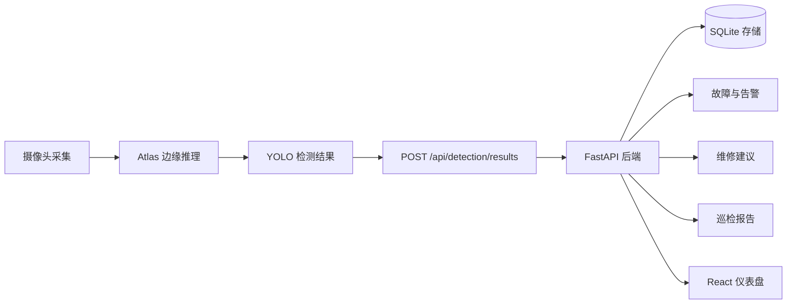

<div align="center">

# EdgeEye

面向电力设备智能巡检演示链路的项目入口，覆盖 Atlas/YOLO 边缘推理、FastAPI 后端和 React 可视化前端。

[](backend/)
[](web/)
[](backend/pyproject.toml)
[](web/tsconfig.app.json)
[](docs/openapi.yaml)

[English](README.md) | 简体中文

</div>

## 项目概览

EdgeEye 用于打通边缘侧巡检数据、后端持久化、告警生成、维修建议、报告导出和前端展示。项目围绕一个最小可演示巡检链路组织：摄像头采集、Atlas 边缘推理、YOLO 检测结果、后端 API 存储与聚合、前端可视化展示。

当前仓库重点包含可运行的后端服务、React 仪表盘，以及全组联调使用的数据契约。

| 区域 | 技术栈 | 作用 |
| --- | --- | --- |
| `backend/` | Python + FastAPI + SQLite | API 服务、巡检存储、检测结果上传、告警、维修建议降级生成、Dashboard 数据和报告导出 |
| `web/` | TypeScript + React + Vite | 系统状态、实时巡检、故障中心、报告中心和资源视图 |
| `docs/` | Markdown + OpenAPI | 跨成员数据契约、API 行为、联调说明、职责边界和审查记录 |
| `docker-compose.yml` | Docker Compose | 成员 4 后端部署脚手架和持久化卷配置 |

## 目录

- [系统架构](#系统架构)
- [当前能力](#当前能力)
- [快速启动](#快速启动)
- [后端](#后端)
- [前端](#前端)
- [配置](#配置)
- [API 概览](#api-概览)
- [契约文档](#契约文档)
- [开发检查](#开发检查)
- [仓库结构](#仓库结构)

## 系统架构



边缘侧向后端提交关键帧检测结果。后端负责保存幂等检测结果、聚合故障和告警、提供系统状态与 Dashboard 数据、在未配置大模型服务时使用规则模板生成维修建议，并提供报告导出文件。前端消费后端定义好的 API 数据；当后端不可用时，前端会使用类型化的降级状态。

## 当前能力

| 能力 | 当前支持 |
| --- | --- |
| 健康检查与系统状态 | `GET /api/health`、`GET /api/system/status` |
| Dashboard 总览 | 设备数、巡检数、故障数、告警数、运行中巡检、未处理故障/告警、最新高风险告警 |
| 巡检生命周期 | 创建、完成、失败、列表查询和最新结果查询 |
| 检测结果上传 | JSON 上传、检测框越界校验、幂等键、重复帧保护 |
| 故障中心 | 设备、故障、告警、聚合事件和处理状态更新 |
| 维修建议 | 默认规则模板降级生成；可配置 OpenAI 兼容接口 |
| 报告中心 | 报告列表、报告详情和 HTML/PDF 导出入口 |
| 前端仪表盘 | Dashboard、实时巡检、故障中心、报告中心、资源视图和演示登录壳 |

## 快速启动

在一个终端启动后端：

```bash
cd backend
uv sync
uv run uvicorn app.main:app --reload
```

在另一个终端启动前端：

```bash
cd web
bun install
bun run dev
```

默认本地地址：

| 服务 | 地址 |
| --- | --- |
| 后端 API | `http://localhost:8000/api` |
| 前端页面 | `http://localhost:5173` |

## 后端

后端是成员 4 负责的 FastAPI 服务，覆盖 API 端点、SQLite 持久化、Dashboard 数据、系统状态、告警、报告和维修建议生成。

在 `backend/` 目录启动：

```bash
uv sync
uv run uvicorn app.main:app --reload
```

运行后端测试：

```bash
uv run pytest
```

也可以在仓库根目录使用 Docker Compose 启动后端：

```bash
docker compose up --build backend
```

Compose 配置会暴露 `8000:8000`，并通过命名卷持久化数据库、上传图片和导出报告。

## 前端

前端是成员 5 负责的 React + Vite 仪表盘，覆盖 Dashboard 总览、实时巡检、故障中心、报告中心、资源视图，以及后续端到端演示流程。

在 `web/` 目录启动：

```bash
bun install
bun run dev
```

构建前端：

```bash
bun run build
```

前端默认请求 `/api`，当后端不可用时会使用类型化 mock/降级数据。后端不在默认地址时，可以设置 `VITE_API_BASE_URL`：

```bash
VITE_API_BASE_URL=http://localhost:8000/api bun run dev
```

## 配置

后端环境变量统一使用 `EDGEEYE_` 前缀。可参考 [backend/.env.example](backend/.env.example)。

| 变量 | 作用 | 默认值 |
| --- | --- | --- |
| `EDGEEYE_DATABASE_PATH` | SQLite 数据库路径 | `data/edgeeye.db` |
| `EDGEEYE_UPLOADS_DIR` | 挂载到 `/uploads` 的静态目录 | `uploads` |
| `EDGEEYE_REPORTS_DIR` | 挂载到 `/reports` 的静态目录 | `reports` |
| `EDGEEYE_LLM_PROVIDER` | 大模型服务选择 | `rule-template` |
| `EDGEEYE_LLM_API_URL` | 可选 OpenAI 兼容 chat-completions 地址 | 未设置 |
| `EDGEEYE_LLM_API_KEY` | 仅后端使用的大模型密钥 | 未设置 |
| `EDGEEYE_LLM_MODEL_NAME` | 维修建议输出中的模型名称元数据 | `rule-template` |
| `EDGEEYE_ALARM_DEDUP_WINDOW_SECONDS` | 告警去重窗口 | `300` |

未配置大模型服务，或调用失败时，`POST /api/advice/generate` 会保存并返回完整的规则模板降级建议。

## API 概览

<details>
<summary>已实现后端接口</summary>

| 域 | 方法 | 路径 |
| --- | --- | --- |
| 健康检查 | `GET` | `/api/health` |
| 系统状态 | `GET` | `/api/system/status` |
| Dashboard | `GET` | `/api/dashboard` |
| 巡检 | `POST` | `/api/inspection/start` |
| 巡检 | `POST` | `/api/inspections/{id}/finish` |
| 巡检 | `POST` | `/api/inspections/{id}/fail` |
| 巡检 | `GET` | `/api/inspections` |
| 巡检 | `GET` | `/api/inspections/{id}/latest-result` |
| 检测结果 | `POST` | `/api/detection/results` |
| 资源 | `GET` | `/api/devices` |
| 故障中心 | `GET` | `/api/faults` |
| 故障中心 | `GET` | `/api/alarms` |
| 故障中心 | `GET` | `/api/events` |
| 故障中心 | `PATCH` | `/api/faults/{id}/status` |
| 故障中心 | `PATCH` | `/api/alarms/{id}/status` |
| 维修建议 | `POST` | `/api/advice/generate` |
| 维修建议 | `GET` | `/api/faults/{id}/advice` |
| 报告 | `GET` | `/api/reports` |
| 报告 | `GET` | `/api/reports/{id}` |
| 报告 | `GET` | `/api/reports/{id}/export` |

</details>

## 契约文档

跨模块字段和 API 行为以以下文档为准：

| 文档 | 作用 |
| --- | --- |
| [docs/contracts.md](docs/contracts.md) | 共享数据结构、枚举、API 响应包裹、幂等规则和前端数据契约 |
| [docs/openapi.yaml](docs/openapi.yaml) | 机器可校验的 API 契约 |
| [docs/api-spec.md](docs/api-spec.md) | 端点级 API 说明 |
| [docs/interfaces-and-deliverables.md](docs/interfaces-and-deliverables.md) | 跨成员数据流、职责边界和交付关系 |
| [docs/engineering-standards.md](docs/engineering-standards.md) | 仓库、配置、日志、测试和联调标准 |

任何临时新增字段、枚举或路由变更，都需要先同步更新相关契约文档，再让实现依赖它。

## 开发检查

联调交付前建议至少执行：

```bash
cd backend
uv run pytest
```

```bash
cd web
bun run build
```

涉及文档和 API 契约变更时，还需要确认 [docs/openapi.yaml](docs/openapi.yaml) 能正常解析，并且与实际接口面保持一致。

## 仓库结构

```text
.
├── backend/              FastAPI 服务、API 路由、Pydantic 模型、SQLite 服务、测试
├── docs/                 契约、工程规范、模块文档、OpenAPI 规范
├── web/                  React + Vite 仪表盘前端
├── docker-compose.yml    后端部署脚手架
├── README.md             英文项目入口
└── README.zh-CN.md       中文项目入口
```
